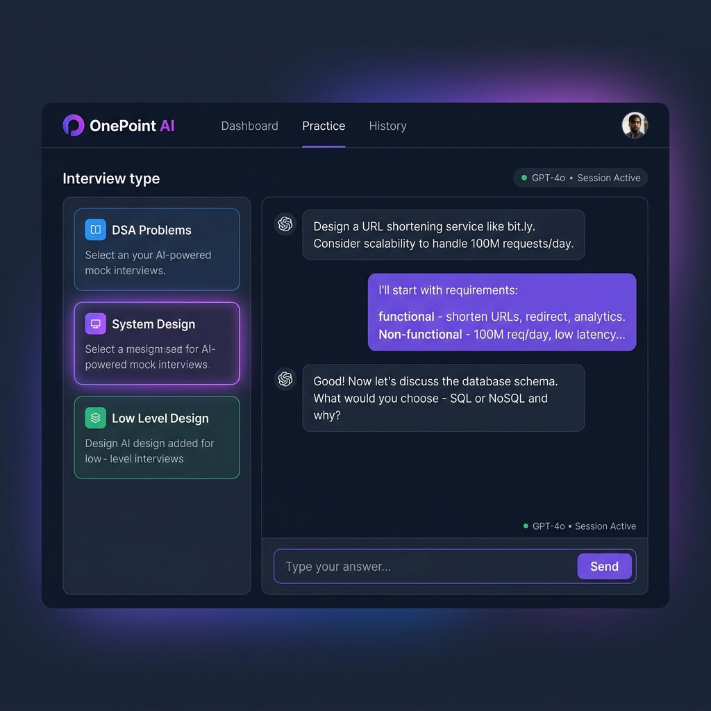

<div align="center">

# 🎯 One Point Interview AI

### AI-Powered Mock Interview Platform for FAANG Preparation

[](https://one-point-interview-ai.vercel.app)
[](https://react.dev)
[](https://nodejs.org)
[](https://firebase.google.com)

Practice **DSA**, **System Design**, and **Low-Level Design** interviews with an AI interviewer that challenges you like a real FAANG engineer.



</div>

---

## ✨ Features

- 🧠 **AI Mock Interviewer** — Simulates real FAANG interview scenarios across three domains
- 📐 **System Design Practice** — Design scalable systems (URL shorteners, chat apps, ride-sharing)
- 🔢 **DSA Problem Solving** — Guided algorithmic problem-solving with hints and follow-ups
- 🏗️ **Low-Level Design** — OOP, design patterns, class diagrams, and component design
- 💬 **Real-Time Chat Interface** — Conversational interview flow with natural back-and-forth
- 🔐 **Firebase Authentication** — Secure login with Google/email sign-in
- 📱 **Fully Responsive** — Works on desktop and mobile

---

## 🛠️ Tech Stack

| Layer | Technology |
|-------|-----------|
| **Frontend** | React 19, Create React App |
| **Backend** | Node.js, Express 5 |
| **Authentication** | Firebase Auth |
| **Deployment** | Vercel (frontend), Railway/Render (backend) |
| **Language** | JavaScript (ES6+) |

---

## 🏗️ Architecture

```
┌─────────────────────────────────────────┐
│         Frontend (React 19)             │
│  ┌──────────┐  ┌──────────────────────┐ │
│  │  Auth    │  │   Chat Interface     │ │
│  │ Firebase │  │  (Interview Session) │ │
│  └──────────┘  └──────────────────────┘ │
└──────────────────────┬──────────────────┘
                       │ HTTP / REST
┌──────────────────────▼──────────────────┐
│         Backend (Express.js)            │
│  ┌──────────────────────────────────┐   │
│  │         AI Interview Engine      │   │
│  │  DSA | System Design | LLD       │   │
│  └──────────────────────────────────┘   │
└─────────────────────────────────────────┘
                       │
┌──────────────────────▼──────────────────┐
│           Firebase / Firestore           │
│     (User data, Interview History)       │
└─────────────────────────────────────────┘
```

---

## 🚀 Getting Started

### Prerequisites
- Node.js 18+
- Firebase project (for authentication)

### 1. Clone the repo
```bash
git clone https://github.com/AltamashAhmad/one-point-interview-ai.git
cd one-point-interview-ai
```

### 2. Setup Frontend
```bash
cd frontend
npm install

# Create .env file
cp .env.example .env
# Add your Firebase config keys
```

### 3. Setup Backend
```bash
cd backend
npm install

# Create .env file
echo "PORT=8080" > .env
```

### 4. Run Locally
```bash
# Terminal 1 — Backend
cd backend && node index.js

# Terminal 2 — Frontend
cd frontend && npm start
```

Open **http://localhost:3000** 🎉

---

## 🌍 Environment Variables

**Frontend** (`frontend/.env`):
```env
REACT_APP_FIREBASE_API_KEY=your_key
REACT_APP_FIREBASE_AUTH_DOMAIN=your_domain
REACT_APP_FIREBASE_PROJECT_ID=your_project_id
REACT_APP_BACKEND_URL=http://localhost:8080
```

---

## 📂 Project Structure

```
one-point-interview-ai/
├── frontend/
│   ├── src/
│   │   ├── App.js              # Root component & routing
│   │   ├── index.js            # Entry point
│   │   └── ...components
│   └── package.json
├── backend/
│   ├── index.js                # Express server entry point
│   └── package.json
└── README.md
```

---

## 🎯 Interview Domains

| Domain | What You Practice |
|--------|------------------|
| **DSA** | Arrays, Trees, Graphs, DP, Two Pointers, Sliding Window |
| **System Design** | HLD, Scalability, Databases, Caching, Load Balancing |
| **Low-Level Design** | OOP, SOLID principles, Design Patterns, Class Diagrams |

---

## 🔮 Roadmap

- [ ] Add voice-based interview mode
- [ ] Interview performance scoring & feedback report
- [ ] Company-specific interview tracks (Google, Meta, Amazon)
- [ ] Code editor integration for live coding rounds
- [ ] Peer interview matching

---

## 👨‍💻 Author

**Altamash Ahmad** — Full Stack Software Developer

[](https://altamashportfolio-inky.vercel.app)
[](https://github.com/AltamashAhmad)
[](https://linkedin.com/in/altamashahmad)

---

<div align="center">
⭐ Star this repo if you found it helpful!
</div>
