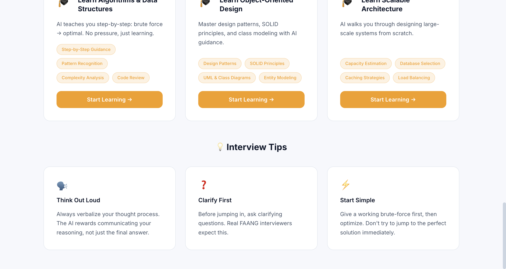
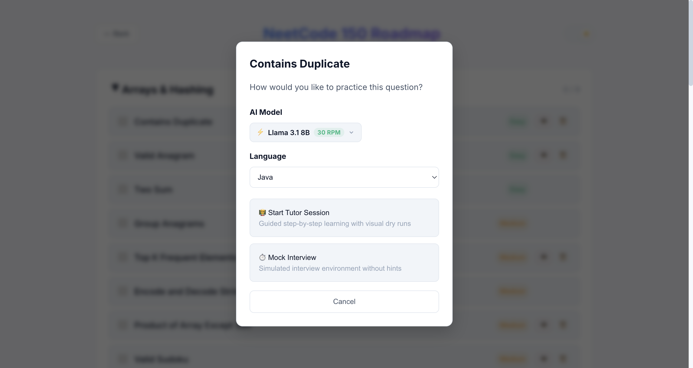
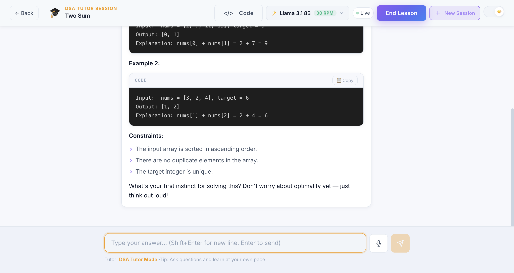

<div align="center">

# 🎯 One Point Interview AI

### AI-Powered Mock Interview Platform for FAANG Preparation

[](https://one-point-interview-ai.vercel.app)
[](https://react.dev)
[](https://nodejs.org)
[](https://firebase.google.com)
[](https://ai.meta.com/llama/)

Practice **DSA**, **System Design**, and **Low-Level Design** interviews with an AI interviewer that challenges you like a real FAANG engineer.



</div>

---

## ✨ Key Features

- 🧠 **AI Mock Interviewer** — Simulates real FAANG interview scenarios across three domains.
- ⚡ **Powered by Groq & Llama 3.1 8B** — Lightning-fast responses with the highest token quotas using Groq's LPU. (Gemini 3.5 Flash / 3.1 Pro also available).
- 🗺️ **NeetCode 150 Roadmap Integration** — Pick questions directly from the interactive roadmap and jump right into a Tutor Session.
- 🔄 **Global Session Persistence** — Your active sessions are automatically saved and restored when you return, just like ChatGPT. You can jump between the Roadmap, Home, and History pages without losing your interview progress.
- 📝 **Automated Scorecards & Feedback** — At the end of a timed interview, a detailed scorecard is generated highlighting your strengths, weaknesses, and a suggested optimized solution.
- 💬 **Real-Time Chat Interface** — Conversational interview flow with natural back-and-forth, Markdown support, and code syntax highlighting.
- 🔐 **Firebase Authentication** — Secure login with Google/Email sign-in and user data isolation.

---

## 📸 Screenshots

### 1. Seamless Roadmap Integration
Start an interview directly from the interactive DSA roadmap. Defaults to **Llama 3.1 8B** for instant responses.


### 2. Auto-Resuming Interview Sessions
Your active sessions are seamlessly resumed when you navigate back. Code, chat, and timers remain perfectly in sync.


### 3. "New Session" Fast Retry
Start a clean, brand-new session for a roadmap question with a single click from the hamburger menu.


---

## 🛠️ Tech Stack

| Layer | Technology |
|-------|-----------|
| **Frontend** | React 19, Create React App |
| **Backend** | Node.js, Express 5 |
| **Authentication & Database** | Firebase Auth, Cloud Firestore |
| **LLM Inference** | Groq API (Llama 3.1 8B), Gemini API |
| **Deployment** | Vercel (frontend), Railway/Render (backend) |

---

## 🏗️ Architecture

```
┌─────────────────────────────────────────┐
│         Frontend (React 19)             │
│  ┌──────────┐  ┌──────────────────────┐ │
│  │  Auth    │  │   Chat Interface     │ │
│  │ Firebase │  │  (Session Manager)   │ │
│  └──────────┘  └──────────────────────┘ │
└──────────────────────┬──────────────────┘
                       │ HTTP / REST
┌──────────────────────▼──────────────────┐
│         Backend (Express.js)            │
│  ┌──────────────────────────────────┐   │
│  │         AI Interview Engine      │   │
│  │  DSA | System Design | LLD       │   │
│  └──────────────────────────────────┘   │
└─────────────────────────────────────────┘
                       │
┌──────────────────────▼──────────────────┐
│           Firebase / Firestore           │
│     (User data, Interview History)       │
└─────────────────────────────────────────┘
```

---

## 🚀 Getting Started

### Prerequisites
- Node.js 18+
- Firebase project (Authentication & Firestore enabled)
- Groq API Key & Gemini API Key

### 1. Clone the repo
```bash
git clone https://github.com/AltamashAhmad/one-point-interview-ai.git
cd one-point-interview-ai
```

### 2. Setup Frontend
```bash
cd frontend
npm install

# Create .env file
cp .env.example .env
# Add your Firebase config keys
```

### 3. Setup Backend
```bash
cd ../backend
npm install

# Create .env file
echo "PORT=8080" > .env
echo "GEMINI_API_KEY=your_key_here" >> .env
echo "GROQ_API_KEY=your_key_here" >> .env
```

### 4. Run Locally
```bash
# Terminal 1 — Backend
cd backend && npm start

# Terminal 2 — Frontend
cd frontend && npm start
```

Open **http://localhost:3000** 🎉

---

## 🌍 Environment Variables

**Frontend** (`frontend/.env`):
```env
REACT_APP_FIREBASE_API_KEY=your_key
REACT_APP_FIREBASE_AUTH_DOMAIN=your_domain
REACT_APP_FIREBASE_PROJECT_ID=your_project_id
REACT_APP_BACKEND_URL=http://localhost:8080
```

---

## 🎯 Interview Domains

| Domain | What You Practice |
|--------|------------------|
| **DSA** | Arrays, Trees, Graphs, DP, Two Pointers, Sliding Window |
| **System Design** | HLD, Scalability, Databases, Caching, Load Balancing |
| **Low-Level Design** | OOP, SOLID principles, Design Patterns, Class Diagrams |

---

## 👨‍💻 Author

**Altamash Ahmad** — Full Stack Software Developer

[](https://altamashportfolio-inky.vercel.app)
[](https://github.com/AltamashAhmad)
[](https://linkedin.com/in/altamashahmad)

---

<div align="center">
⭐ Star this repo if you found it helpful!
</div>
