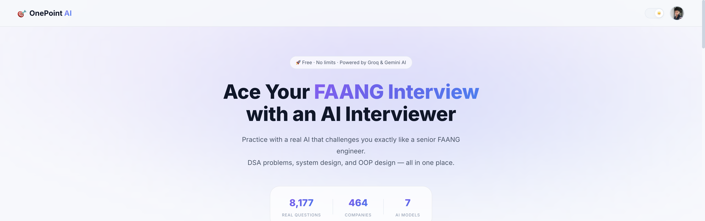
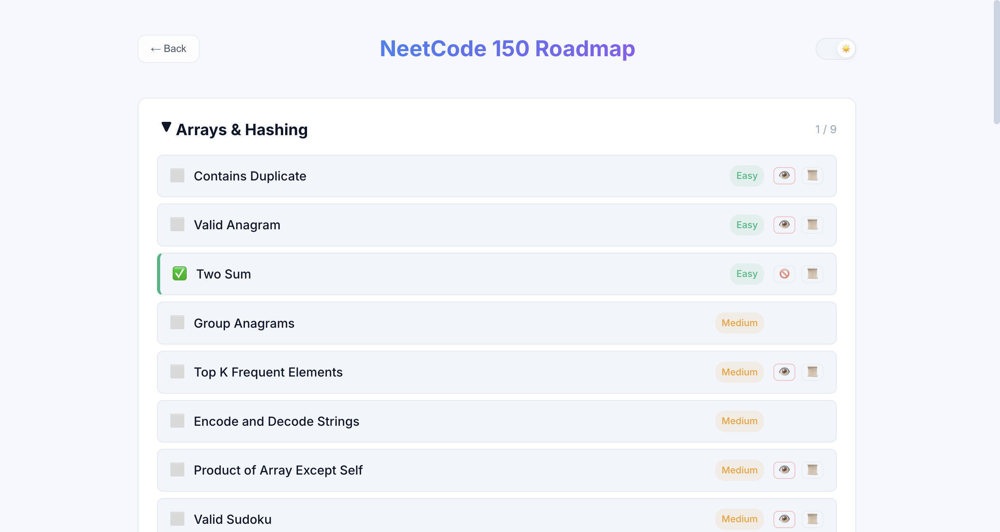
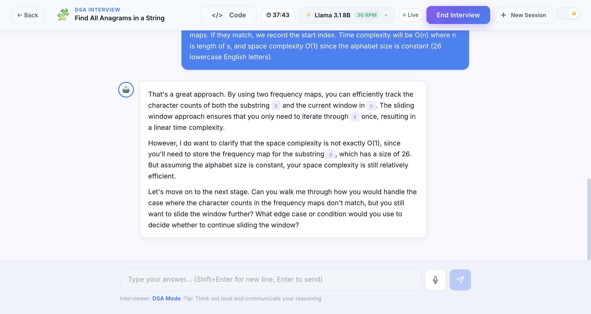

<div align="center">

# 🎯 One Point Interview AI

### An Intelligent Mock Interview Platform built for FAANG-level Engineering Prep.

[](https://main.d369q8sr84jlxa.amplifyapp.com/)
[](https://react.dev)
[](https://nodejs.org)
[](https://firebase.google.com)
[](https://groq.com)
[](https://ai.meta.com/llama/)

One Point Interview AI simulates real-world engineering interviews. Practice **Data Structures & Algorithms**, **System Design**, and **Low-Level Design** with an AI that doesn't just give you the answer—it pushes you to think, communicate, and solve problems like a senior engineer.



</div>

---

## 🌟 Why I Built This (For Interviewers & Engineers)

I built One Point Interview AI to solve a genuine problem in tech recruitment prep: static LeetCode grinding doesn't teach you how to communicate. In a real FAANG interview, the interviewer cares just as much about **clarifying questions**, **edge cases**, and **trade-offs** as they do about the final code. 

This platform bridges that gap by providing a **conversational, context-aware AI interviewer** powered by lightning-fast LLM inference (Groq & Llama 3.1). It features global session persistence—allowing users to seamlessly bounce between a DSA roadmap, their dashboard, and active interview sessions without losing a single message of context.

---

## ✨ Key Technical Features

- 🧠 **Context-Aware Interview Engine**: Tailored prompts depending on the interview domain (DSA vs. System Design vs. LLD). The AI acts as an interviewer, dropping hints and asking follow-ups instead of just dumping code.
- ⚡ **Groq LPU Integration**: Utilizes Llama 3.1 8B via Groq for ultra-low latency streaming responses. Fallbacks exist for Gemini 3.5 Flash and Gemini 3.1 Pro for high-reasoning architectural tasks.
- 🔄 **Global Session Persistence**: Built a robust state-management system. Navigate away from an active interview, browse the interactive roadmap, and jump right back in. The session state and timers resume flawlessly.
- 🗺️ **NeetCode 150 Integration**: An interactive roadmap directly integrated into the platform. Users can pick a specific question and instantly launch a localized AI tutor session.
- 📊 **Automated Scorecards**: At the conclusion of a timed interview, a secondary LLM pipeline generates a markdown-based scorecard evaluating the user's communication, problem-solving speed, and code optimality.
- 💬 **Rich Markdown Chat**: Support for syntax-highlighted code blocks and Mermaid.js diagrams directly in the chat interface.

---

## 📸 Platform Walkthrough

### 1. Seamless Roadmap Integration
Start an interview directly from the interactive DSA roadmap. Powered by **Llama 3.1 8B** for instant responses.


### 2. Auto-Resuming Interview Sessions
Your active sessions are seamlessly resumed when you navigate back. Code, chat, and timers remain perfectly in sync.


### 3. "New Session" Fast Retry
Start a clean, brand-new session for a roadmap question with a single click from the hamburger menu.


---

## 🛠️ Tech Stack & Architecture

This project is a full-stack JavaScript monolith designed for speed and state resilience.

| Layer | Technology | Purpose |
|-------|-----------|---------|
| **Frontend** | React 19, CSS3 | Component-driven UI, Context API for global state |
| **Backend** | Node.js, Express 5 | REST API, prompt orchestration, and LLM communication |
| **Authentication**| Firebase Auth | Secure Google/Email sign-in |
| **Database** | Cloud Firestore | NoSQL storage for user profiles and chat histories |
| **LLM Inference** | Groq API, Gemini API | Streaming conversational responses and scorecard generation |
| **Deployment** | AWS Amplify | High-availability global CDN hosting |

### System Flow
1. **Client** initiates a session via the React frontend.
2. **Express Backend** receives the request, constructs the domain-specific system prompt, and forwards the context to the **Groq/Gemini API**.
3. **Firestore** acts as the source of truth, continuously syncing chat history so users can securely access their past interviews from any device.

---

## 🚀 Run It Locally

### Prerequisites
- Node.js 18+
- Firebase project (Authentication & Firestore enabled)
- Groq API Key & Gemini API Key

### 1. Clone the repo
```bash
git clone https://github.com/AltamashAhmad/one-point-interview-ai.git
cd one-point-interview-ai
```

### 2. Setup Frontend
```bash
cd frontend
npm install

# Create .env file
cp .env.example .env
# Add your Firebase config keys
```

### 3. Setup Backend
```bash
cd ../backend
npm install

# Create .env file
echo "PORT=8080" > .env
echo "GEMINI_API_KEY=your_key_here" >> .env
echo "GROQ_API_KEY=your_key_here" >> .env
```

### 4. Run Locally
```bash
# Terminal 1 — Backend
cd backend && npm start

# Terminal 2 — Frontend
cd frontend && npm start
```

Open **http://localhost:3000** 🎉

---

## 👨‍💻 About The Author

**Altamash Ahmad** — Full Stack Software Engineer passionate about building scalable, user-centric web applications and AI-driven platforms.

[](https://altamashportfolio-inky.vercel.app/)
[](https://github.com/AltamashAhmad)
[](https://www.linkedin.com/in/altamash9648/?skipRedirect=true)

---

<div align="center">
⭐ If you're an interviewer, recruiter, or engineer, feel free to try the live demo and reach out! ⭐
</div>
