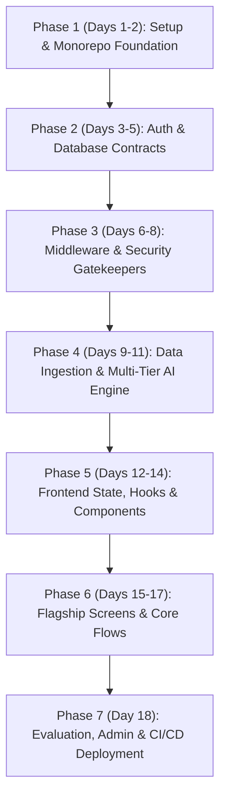

# 🗺️ Master Engineering Blueprint: Building One Point Interview AI from Scratch

> **Audience**: Junior Software Engineer / Fresher  
> **Goal**: Understand how a Software Development Engineer (SDE) plans, architects, and codes this entire full-stack project from Day 0 to Day 18. Every file, line of code, and architectural pattern is mapped in the exact order it should be created.

---

## 🧠 The SDE Mental Model: Where Do You Start?

When beginners build a project, they often jump directly to the UI (e.g., drawing chat bubbles) or calling the AI API directly from the browser. **A professional SDE does the opposite**:

1. **Foundations First**: Directory structure, environments, and dependencies.
2. **Data & Auth Contracts**: How users log in, how database security rules protect data.
3. **The Core Engine**: Gatekeeping middleware, question ingestion, and AI prompt pipelines.
4. **API Endpoints**: REST interfaces that connect the database and AI to the outside world.
5. **Frontend State & Architecture**: Auth context, API client, custom hooks, and persistence.
6. **Frontend UI & Components**: Markdown rendering, Mermaid flowchart sanitization, Monaco code editor.
7. **Flagship Assembly**: The main interview screen, NeetCode 150 roadmap, and interview loops.
8. **DevOps & Production**: Reverse proxies, CI/CD pipelines, and health checks.

---

## 📅 The 18-Day Reconstruction Roadmap

---

### Phase 1: Setup & Monorepo Foundations

#### 🗓️ Day 1: Project Initialization & Monorepo Skeleton
* **SDE Objective**: Set up the repository, configure package managers, isolate secrets, and establish the server entry point.
* **Files to create & study**:
  1. [`.gitignore`](file:///Users/altamashahmad/Desktop/one-point-interview-ai/.gitignore): Why we block `.env`, `node_modules`, service account keys, and large data dumps.
  2. [`backend/package.json`](file:///Users/altamashahmad/Desktop/one-point-interview-ai/backend/package.json): Core backend dependencies (`express 5`, `@google/generative-ai`, `groq-sdk`, `firebase-admin`, `helmet`, `cors`, `nodemailer`).
  3. [`backend/index.js`](file:///Users/altamashahmad/Desktop/one-point-interview-ai/backend/index.js) *(Lines 1–41, 80–101)*: Basic Express 5 app listener, Helmet security headers, CORS origin whitelisting, and JSON body parser limit (2MB).
* **Self-Check Question**: Why do we set `app.set('trust proxy', 1)` on line 22 of `backend/index.js`? *(Hint: When running behind Caddy/Nginx, Express needs to read the true client IP from `X-Forwarded-For` for rate limiting).*

#### 🗓️ Day 2: Frontend Foundation & Design System Tokens
* **SDE Objective**: Bootstrap the React application, establish CSS custom variables (design tokens), and define responsive font systems.
* **Files to create & study**:
  1. [`frontend/package.json`](file:///Users/altamashahmad/Desktop/one-point-interview-ai/frontend/package.json): React 19, React Router v7, `@monaco-editor/react`, `mermaid`, `react-markdown`, `react-resizable-panels`.
  2. [`frontend/src/index.js`](file:///Users/altamashahmad/Desktop/one-point-interview-ai/frontend/src/index.js): React 19 `ReactDOM.createRoot` mounting.
  3. [`frontend/src/index.css`](file:///Users/altamashahmad/Desktop/one-point-interview-ai/frontend/src/index.css): Design tokens: CSS variables for light/dark themes (`--bg-primary`, `--bg-card`, `--purple-primary`, `--accent-glow`), scrollbar styling, and reset styles.
  4. [`frontend/src/contexts/ThemeContext.js`](file:///Users/altamashahmad/Desktop/one-point-interview-ai/frontend/src/contexts/ThemeContext.js): Detecting system preference (`prefers-color-scheme`), applying `data-theme` attribute to `<html>`, and persisting choices in `localStorage`.

---

### Phase 2: Database & Authentication Contracts

#### 🗓️ Day 3: Firebase SDK Initialization (Backend & Frontend)
* **SDE Objective**: Establish authenticated communication between the browser, Node.js server, and Google Cloud Firestore.
* **Files to create & study**:
  1. [`backend/config/firebase.js`](file:///Users/altamashahmad/Desktop/one-point-interview-ai/backend/config/firebase.js): Lazy-init pattern for `firebase-admin` with private key newline handling (`\n`).
  2. [`frontend/src/services/firebase.js`](file:///Users/altamashahmad/Desktop/one-point-interview-ai/frontend/src/services/firebase.js): Client-side Firebase configuration, `GoogleAuthProvider` parameter setup, and ReCaptcha v3 `initializeAppCheck`.
  3. [`backend/scripts/seedAdmin.js`](file:///Users/altamashahmad/Desktop/one-point-interview-ai/backend/scripts/seedAdmin.js): Script using `merge: true` to provision the super-admin document without accidental data wipe.

#### 🗓️ Day 4: Firestore NoSQL Modeling & Security Rules
* **SDE Objective**: Design the collections and write security rules so users cannot read or tamper with other candidates' interview data.
* **Files to create & study**:
  1. [`firestore.rules`](file:///Users/altamashahmad/Desktop/one-point-interview-ai/firestore.rules): Granular security policies:
     - `/users/{uid}`: Read allowed if owner or admin. Create allowed with `status: 'PENDING'`. Self-promotion to admin blocked.
     - `/interviews/{docId}`: Read/write locked to `request.auth.uid == resource.data.userId`.
     - `/accessRequests/{docId}`: Pending creation allowed; admin-only review.
  2. [`backend/routes/public.js`](file:///Users/altamashahmad/Desktop/one-point-interview-ai/backend/routes/public.js): Unauthenticated route checking maintenance mode and signup availability.

#### 🗓️ Day 5: Frontend Auth Context & Authentication Screen
* **SDE Objective**: Build a unified authentication state machine supporting Google OAuth popup with seamless redirect fallback.
* **Files to create & study**:
  1. [`frontend/src/contexts/AuthContext.js`](file:///Users/altamashahmad/Desktop/one-point-interview-ai/frontend/src/contexts/AuthContext.js):
     - `onAuthStateChanged` lifecycle listener.
     - Popup-to-redirect automatic fallback for ad-blockers / mobile browsers.
     - Error mapper converting cryptic Firebase codes (`auth/popup-blocked`, `auth/user-not-found`) into user-friendly alerts.
  2. [`frontend/src/pages/Login.js`](file:///Users/altamashahmad/Desktop/one-point-interview-ai/frontend/src/pages/Login.js): Sign-in / sign-up toggle form with public status verification.

---

### Phase 3: Middleware & Security Gatekeepers

#### 🗓️ Day 6: Token Verification & Bot Defense (AppCheck)
* **SDE Objective**: Protect every sensitive backend route from forged tokens, scrapers, and raw HTTP clients like Postman.
* **Files to create & study**:
  1. [`backend/middleware/auth.js`](file:///Users/altamashahmad/Desktop/one-point-interview-ai/backend/middleware/auth.js): `verifyToken` middleware checking `Bearer <idToken>` and handling token revocation.
  2. [`backend/middleware/appCheck.js`](file:///Users/altamashahmad/Desktop/one-point-interview-ai/backend/middleware/appCheck.js): Verifying `X-Firebase-AppCheck` token with dev bypass (`SKIP_APP_CHECK=true`).
  3. [`backend/tests/auth.middleware.test.js`](file:///Users/altamashahmad/Desktop/one-point-interview-ai/backend/tests/auth.middleware.test.js): Mocking Firebase Admin in Jest to verify 401 response handling.

#### 🗓️ Day 7: Access Control, Quota Engine & In-Memory Caching
* **SDE Objective**: Build an access gatekeeper that prevents API abuse, manages free trials, and enforces daily session limits without overloading Firestore.
* **Files to create & study**:
  1. [`backend/middleware/checkUserAccess.js`](file:///Users/altamashahmad/Desktop/one-point-interview-ai/backend/middleware/checkUserAccess.js):
     - In-memory `userCache` (60s TTL) to prevent paying for Firestore reads on every message.
     - Auto-profile provisioning on first login.
     - `BANNED` and `SUSPENDED` (with automatic expiry lifting) enforcement.
     - `PENDING` user 3-trial limit vs. `APPROVED` daily quota with UTC midnight auto-reset.
  2. [`backend/middleware/requireAdmin.js`](file:///Users/altamashahmad/Desktop/one-point-interview-ai/backend/middleware/requireAdmin.js): Admin role check returning generic 403 to avoid leaking route existence.

#### 🗓️ Day 8: User Profile & Access Request Routes
* **SDE Objective**: Allow candidates to inspect their profile quota, submit access requests, and toggle question status.
* **Files to create & study**:
  1. [`backend/routes/users.js`](file:///Users/altamashahmad/Desktop/one-point-interview-ai/backend/routes/users.js): `GET /api/users/me` (returns profile, remaining trials, daily quota) and `PUT /api/users/me/uncheck`.
  2. [`backend/routes/access.js`](file:///Users/altamashahmad/Desktop/one-point-interview-ai/backend/routes/access.js): `POST /api/access/request` preventing duplicate submissions.
  3. [`backend/services/emailService.js`](file:///Users/altamashahmad/Desktop/one-point-interview-ai/backend/services/emailService.js): HTML email notifications via Nodemailer for access request approvals and denials.

---

### Phase 4: Data Ingestion & Multi-Tier AI Engine

#### 🗓️ Day 9: Question Bank Ingestion & Normalization
* **SDE Objective**: Ingest thousands of real interview problems into fast, searchable in-memory structures.
* **Files to create & study**:
  1. [`backend/scripts/build-question-bank.js`](file:///Users/altamashahmad/Desktop/one-point-interview-ai/backend/scripts/build-question-bank.js): ETL script parsing CSVs and markdown into structured JSON.
  2. [`backend/services/questionBank.js`](file:///Users/altamashahmad/Desktop/one-point-interview-ai/backend/services/questionBank.js):
     - `normalizeCompany` slug generator and alias map (`meta` → `facebook`, `aws` → `amazon`).
     - Difficulty filtering and practiced question exclusion.
  3. [`backend/routes/questions.js`](file:///Users/altamashahmad/Desktop/one-point-interview-ai/backend/routes/questions.js): Company autocomplete endpoint.

#### 🗓️ Day 10: Prompt Engineering & Anti-Recitation Safety
* **SDE Objective**: Program the AI interviewer's persona, progression stages, and safety filters.
* **Files to create & study**:
  1. [`backend/services/prompts.js`](file:///Users/altamashahmad/Desktop/one-point-interview-ai/backend/services/prompts.js):
     - `sanitizePromptInput`: Stripping control characters and prompt injection attacks (`ignore all previous instructions`).
     - Anti-Recitation safety guidelines to avoid Google API copyright blocks.
     - Natural interview progression: Understanding → Edge Cases → Coding → Evaluation.
     - Mode prompts: DSA, System Design, LLD, Managerial, and Tutor modes.
  2. [`backend/tests/prompts.test.js`](file:///Users/altamashahmad/Desktop/one-point-interview-ai/backend/tests/prompts.test.js): Unit testing the prompt input sanitizer.

#### 🗓️ Day 11: Multi-Provider AI Inference & Quota Cascading
* **SDE Objective**: Connect to Groq, Gemini, and OpenRouter, implementing seamless fallback routing so users never hit downtime.
* **Files to create & study**:
  1. [`backend/services/groq.js`](file:///Users/altamashahmad/Desktop/one-point-interview-ai/backend/services/groq.js): Groq SDK completions with quota error detection (`isGroqQuotaError`).
  2. [`backend/services/gemini.js`](file:///Users/altamashahmad/Desktop/one-point-interview-ai/backend/services/gemini.js): `GoogleGenerativeAI` client, `MODEL_FALLBACK_CHAIN`, timeout races, and VIP admin key pooling.
  3. [`backend/services/openrouter.js`](file:///Users/altamashahmad/Desktop/one-point-interview-ai/backend/services/openrouter.js): OpenRouter API integration.
  4. [`backend/routes/chat.js`](file:///Users/altamashahmad/Desktop/one-point-interview-ai/backend/routes/chat.js): Central AI router executing Groq → OpenRouter → Gemini cascading fallback.

---

### Phase 5: Frontend State, Hooks & Custom Components

#### 🗓️ Day 12: API Client & Resilient Session Hooks
* **SDE Objective**: Build the client communication layer and hooks that keep interviews alive across page refreshes.
* **Files to create & study**:
  1. [`frontend/src/services/api.js`](file:///Users/altamashahmad/Desktop/one-point-interview-ai/frontend/src/services/api.js): Axios instance automatically attaching Firebase Bearer tokens and AppCheck headers.
  2. [`frontend/src/hooks/useSessionPersist.js`](file:///Users/altamashahmad/Desktop/one-point-interview-ai/frontend/src/hooks/useSessionPersist.js): Caching `messages`, `sessionId`, `questionMeta`, and `model` in `localStorage` scoped by interview type.
  3. [`frontend/src/hooks/useInterviewTimer.js`](file:///Users/altamashahmad/Desktop/one-point-interview-ai/frontend/src/hooks/useInterviewTimer.js): Countdown timer calculating absolute expiration timestamp so refreshes don't reset the clock.
  4. [`frontend/src/hooks/useVoiceToText.js`](file:///Users/altamashahmad/Desktop/one-point-interview-ai/frontend/src/hooks/useVoiceToText.js): Web Speech API wrapper with silence auto-restart and deduplication.

#### 🗓️ Day 13: Bulletproof Mermaid Diagram Sanitizer
* **SDE Objective**: Solve the #1 AI frontend issue: invalid Mermaid flowchart syntax crashing the DOM.
* **Files to create & study**:
  1. [`frontend/src/components/MermaidDiagram.js`](file:///Users/altamashahmad/Desktop/one-point-interview-ai/frontend/src/components/MermaidDiagram.js):
     - The 10 regex rules: fixing `graph 3D`, nested quotes, special characters inside shapes, arrow collisions.
     - The 3-tier fallback pipeline: sanitized render → aggressive quote-all → strip subgraphs → graceful raw text fallback.
  2. [`frontend/src/components/MessageBubble.js`](file:///Users/altamashahmad/Desktop/one-point-interview-ai/frontend/src/components/MessageBubble.js): Markdown renderer integrating Prism syntax highlighting, copy button, and Mermaid renderer.

#### 🗓️ Day 14: Interactive Components (Editor, Models & Setup)
* **SDE Objective**: Build the interactive controls candidates use before and during an interview.
* **Files to create & study**:
  1. [`frontend/src/components/CodeEditor.js`](file:///Users/altamashahmad/Desktop/one-point-interview-ai/frontend/src/components/CodeEditor.js): Monaco Editor integration with syntax selection, auto-save to `localStorage`, and "Submit for Review".
  2. [`frontend/src/components/ModelSelector.js`](file:///Users/altamashahmad/Desktop/one-point-interview-ai/frontend/src/components/ModelSelector.js): Dropdown organizing models into Tier 1 Flagship, Tier 2 Fast Backup, and Tier 3 Heavyweight with RPM/RPD badges.
  3. [`frontend/src/components/InterviewSetup.js`](file:///Users/altamashahmad/Desktop/one-point-interview-ai/frontend/src/components/InterviewSetup.js): Configuration wizard with company autocomplete, difficulty cards, and language selector.

---

### Phase 6: Flagship Screens & Core Flows

#### 🗓️ Day 15: The Flagship Interview Arena
* **SDE Objective**: Assemble the main interview workspace connecting chat, code editor, timers, and AI streaming.
* **Files to create & study**:
  1. [`frontend/src/pages/Interview.js`](file:///Users/altamashahmad/Desktop/one-point-interview-ai/frontend/src/pages/Interview.js):
     - Dynamic split pane (`react-resizable-panels`) between Monaco Editor and Chat.
     - Automatic session resumption from URL params or Firestore active history.
     - Mid-interview model switching without losing context or tokens.
     - Auto-submission on timer expiry.
  2. [`frontend/src/App.js`](file:///Users/altamashahmad/Desktop/one-point-interview-ai/frontend/src/App.js):
     - `AccessGate`: Blocking banned, suspended, or trial-exhausted candidates.
     - Lazy page loading (`React.lazy`) and `ErrorBoundary`.

#### 🗓️ Day 16: The NeetCode 150 Roadmap & Landing Dashboard
* **SDE Objective**: Build the candidate home base and interactive DSA study tree.
* **Files to create & study**:
  1. [`frontend/src/services/neetcode150.js`](file:///Users/altamashahmad/Desktop/one-point-interview-ai/frontend/src/services/neetcode150.js): Structured question tree (Arrays, Pointers, Sliding Window, Trees, Graphs, DP).
  2. [`frontend/src/pages/Roadmap.js`](file:///Users/altamashahmad/Desktop/one-point-interview-ai/frontend/src/pages/Roadmap.js): Collapsible topic groups, completion checkmarks, history drilldown, and "Practice with AI Tutor" launch buttons.
  3. [`frontend/src/pages/Landing.js`](file:///Users/altamashahmad/Desktop/one-point-interview-ai/frontend/src/pages/Landing.js): Main hub displaying practice tracks (DSA, System Design, LLD, Tutor modes) and interview loop cards.

---

### Phase 7: Evaluation, Admin & CI/CD Deployment

#### 🗓️ Day 17: AI Scorecards, Revision Notes & Loops
* **SDE Objective**: Grade the candidate's interview transcript, generate revision guides, and track multi-round company loops.
* **Files to create & study**:
  1. [`backend/routes/history.js`](file:///Users/altamashahmad/Desktop/one-point-interview-ai/backend/routes/history.js): Scorecard evaluation prompt, strict JSON parser, and revision notes generator.
  2. [`frontend/src/pages/Scorecard.js`](file:///Users/altamashahmad/Desktop/one-point-interview-ai/frontend/src/pages/Scorecard.js): Visual scorecard displaying Hire/No Hire verdict, scores (0-100), strengths, and weaknesses.
  3. [`frontend/src/pages/History.js`](file:///Users/altamashahmad/Desktop/one-point-interview-ai/frontend/src/pages/History.js) & [`HistoryDetail.js`](file:///Users/altamashahmad/Desktop/one-point-interview-ai/frontend/src/pages/HistoryDetail.js): Pinned sessions (max 3), full transcript review, and editable AI notes.
  4. [`backend/routes/loops.js`](file:///Users/altamashahmad/Desktop/one-point-interview-ai/backend/routes/loops.js) & [`frontend/src/pages/LoopDashboard.js`](file:///Users/altamashahmad/Desktop/one-point-interview-ai/frontend/src/pages/LoopDashboard.js): Company loop progression pipeline (pass/fail round status).

#### 🗓️ Day 18: Admin Back-Office & Production CI/CD
* **SDE Objective**: Administer the platform (approving requests, adjusting quotas) and ship code automatically via CI/CD.
* **Files to create & study**:
  1. [`backend/routes/admin.js`](file:///Users/altamashahmad/Desktop/one-point-interview-ai/backend/routes/admin.js) & [`frontend/src/pages/Admin.js`](file:///Users/altamashahmad/Desktop/one-point-interview-ai/frontend/src/pages/Admin.js): System metrics, user search, quota modification, access request review, and maintenance toggle.
  2. [`frontend/src/pages/AccessWall.js`](file:///Users/altamashahmad/Desktop/one-point-interview-ai/frontend/src/pages/AccessWall.js): Paywall modal for users whose 3 free trials are exhausted.
  3. [`Caddyfile`](file:///Users/altamashahmad/Desktop/one-point-interview-ai/Caddyfile): Automated SSL reverse proxy routing traffic to Node.js.
  4. [`.github/workflows/backend-deploy.yml`](file:///Users/altamashahmad/Desktop/one-point-interview-ai/.github/workflows/backend-deploy.yml): GitHub Actions deployment pipeline to AWS EC2 using PM2.

---

## 🎯 How to Learn This Project Step-by-Step

Whenever you are ready to study a day:
1. Open the files mapped for that day in your editor.
2. Read the code line-by-line following the mental model notes.
3. Ask your AI pair programmer: *"Let's do Day [X]. Explain lines Y to Z and quiz me on the architecture."*
