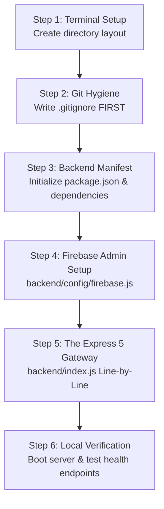

# 📅 Day 1: Project Setup & Backend Entry Architecture

> **SDE Mental Model**: Before writing any business logic, LLM calls, or frontend views, an engineer establishes the project foundations: repository layout, git secret protection, dependency manifests, database connection singletons, and the minimal viable HTTP gateway.
>
> If you were asked in an interview: *"How do you architect and boot up a production AI web service from an empty folder?"*, this document is your complete, line-by-line answer.

---

## 🗺️ From-Scratch Build Flowchart



---

## 🛠️ Step 1: Project Architecture & Directory Layout

We separate frontend and backend cleanly into a monorepo structure:
- `backend/`: Node.js Express API server (handles AI LLM orchestration, auth verification, database transactions, rate limiting).
- `frontend/`: React 19 Single Page Application (UI, Monaco code editor, chat, NeetCode 150 roadmap).
- `study_plan/`: Architectural documentation and day-by-day engineering blueprints.

### Terminal Commands:
```bash
mkdir one-point-interview-ai
cd one-point-interview-ai
git init
mkdir backend frontend study_plan
```

---

## 🛡️ Step 2: Git Hygiene — Write `.gitignore` Before Anything Else

> [!CAUTION]
> **Golden SDE Rule**: You write `.gitignore` **before** running `npm install` or creating `.env`. If you accidentally commit an API key or a Firebase Admin private key to GitHub, automated bots scrape and compromise your account within 30 seconds.

Open [`.gitignore`](file:///Users/altamashahmad/Desktop/one-point-interview-ai/.gitignore). Here is the line-by-line breakdown:

```gitignore
# Lines 1-4: NEVER commit environment files
.env
.env.local
.env.*.local

# Lines 6-9: Dependencies (installed locally via npm install)
node_modules/
npm-debug.log*
yarn-debug.log*
yarn-error.log*

# Lines 11-13: Production build artifacts & OS junk
frontend/build/
.DS_Store

# Lines 27-32: Firebase Service Account Private Keys
*service-account*.json
firebase-adminsdk*.json
*firebase-adminsdk*.json
one-point-interview-ai-*.json

# Lines 34-39: Raw question datasets cloned for the build script
awesome-low-level-design/
interview-company-wise-problems/
leetcode-companywise-interview-questions/
system-design-primer/
Archive.zip
```

### Why each entry matters:
1. **`.env`**: Stores `GROQ_API_KEY`, `GEMINI_API_KEY`, `ADMIN_UID`, `GMAIL_APP_PASSWORD`. Committing this exposes your credentials and budget.
2. **`node_modules/`**: Contains thousands of downloaded library files. Committing this inflates repository size and causes merge conflicts.
3. **`*service-account*.json`**: This is your Firebase Admin Master Key. Anyone who obtains this JSON file gets full root read/write access to your entire database, completely bypassing Firestore security rules.
4. **Cloned Repos**: The raw repos used by `backend/scripts/build-question-bank.js` are several hundred megabytes. We only commit the parsed JSON outputs in `backend/data/`.

---

## 📦 Step 3: Backend Manifest — `backend/package.json`

Navigate into `backend/` and initialize our Node.js package manifest:

```bash
cd backend
npm init -y
npm install express@^5.1.0 helmet cors dotenv express-rate-limit firebase-admin @google/generative-ai groq-sdk nodemailer
npm install --save-dev jest supertest
```

Open [`backend/package.json`](file:///Users/altamashahmad/Desktop/one-point-interview-ai/backend/package.json). Here is what each dependency does in our architecture:

```json
"dependencies": {
  "express": "^5.1.0",
  "helmet": "^8.2.0",
  "cors": "^2.8.6",
  "dotenv": "^17.4.2",
  "express-rate-limit": "^8.5.2",
  "firebase-admin": "^13.10.0",
  "groq-sdk": "^1.2.0",
  "@google/generative-ai": "^0.24.1",
  "nodemailer": "^9.0.0"
}
```

### SDE Breakdown of Dependencies:
| Package | Version | Why an SDE Uses It |
| :--- | :--- | :--- |
| `express` | `^5.1.0` | **Next-generation HTTP server**. In Express 4, if an `async` route handler threw an unhandled error, the entire Node.js server crashed unless wrapped in an `asyncHandler`. Express 5 automatically routes rejected Promises straight to your centralized error middleware! |
| `helmet` | `^8.2.0` | **HTTP Security Headers**. Automatically injects `X-Content-Type-Options: nosniff`, `X-Frame-Options: SAMEORIGIN`, and CSP headers to protect against cross-site scripting (XSS) and clickjacking. |
| `cors` | `^2.8.6` | **Cross-Origin Isolation**. Restricts API access strictly to your allowed frontend origins (`http://localhost:3000` or production AWS Amplify URL), dropping requests from unauthorized domains. |
| `dotenv` | `^17.4.2` | **Environment Variable Loader**. Injects secrets from `.env` into `process.env`. |
| `express-rate-limit` | `^8.5.2` | **DDoS & Scraping Defense**. Limits each IP to 100 requests per 15-minute window, returning HTTP 429 when abused. |
| `firebase-admin` | `^13.10.0` | **Privileged Backend SDK**. Verifies client Firebase JWT tokens and performs administrative Firestore queries with root authority. |
| `groq-sdk` | `^1.2.0` | **Ultra-Fast LLM Inference**. Runs Meta's `llama-3.1-8b-instant` and `llama-3.3-70b-versatile` on Groq LPU hardware with sub-second latency. |
| `@google/generative-ai` | `^0.24.1` | **Reasoning LLM Engine**. Connects to Google's Gemini models for high-reasoning interview domains and scorecard evaluations. |
| `nodemailer` | `^9.0.0` | **Transactional Emailing**. Connects via Gmail SMTP to alert administrators of new access requests and notify approved candidates. |

---

## 🔑 Step 4: Firebase Admin Singleton — `backend/config/firebase.js`

Before the server accepts requests, it needs a database connection. We build a singleton module in [`backend/config/firebase.js`](file:///Users/altamashahmad/Desktop/one-point-interview-ai/backend/config/firebase.js).

### Line-by-Line Breakdown:

```javascript
// Line 1: Import the official Firebase Admin SDK
const admin = require('firebase-admin');

// Line 3: Guard against multiple re-initializations during testing or hot-reloading
if (!admin.apps.length) {
  try {
    // Strategy A: Check if service account JSON is passed via an environment variable
    if (process.env.FIREBASE_SERVICE_ACCOUNT_KEY) {
      const serviceAccount = JSON.parse(process.env.FIREBASE_SERVICE_ACCOUNT_KEY);
      admin.initializeApp({
        credential: admin.credential.cert(serviceAccount),
      });
    } 
    // Strategy B: Check if a local serviceAccountKey.json file exists on disk
    else if (process.env.FIREBASE_SERVICE_ACCOUNT_PATH) {
      const serviceAccount = require(process.env.FIREBASE_SERVICE_ACCOUNT_PATH);
      admin.initializeApp({
        credential: admin.credential.cert(serviceAccount),
      });
    } 
    // Strategy C: Fallback to Google Application Default Credentials (ADC) on cloud hosting (EC2/GCP)
    else {
      admin.initializeApp();
    }
    console.log('✅ Firebase Admin initialized');
  } catch (error) {
    console.error('❌ Firebase Admin initialization error:', error.message);
  }
}

// Line 28: Export the initialized admin instance for reuse across the entire app
module.exports = admin;
```

### Why an SDE designs it this way:
1. `if (!admin.apps.length)`: Prevents Firebase from throwing `FirebaseAppError: The default Firebase app already exists` when test suites like Jest run.
2. **Multi-Strategy Auth**: Local developers can use a JSON file, production cloud servers (like EC2 or AWS Amplify) can use an environment variable, and GCP VMs can use IAM default credentials without modifying a single line of application code.

---

## 🚀 Step 5: The Server Gateway Line-by-Line — `backend/index.js`

Now let's trace every single line of [`backend/index.js`](file:///Users/altamashahmad/Desktop/one-point-interview-ai/backend/index.js) from top to bottom.

### 1. Robust Environment Loading (Line 1)
```javascript
require('dotenv').config({ path: require('path').join(__dirname, '.env') });
```
- **Why**: By default, `dotenv.config()` searches the current working directory (`process.cwd()`). If you run `npm start` from the root repository directory instead of `backend/`, standard dotenv will fail to find `.env`. Passing `path.join(__dirname, '.env')` guarantees that it always resolves `backend/.env` regardless of where the command was executed!

### 2. Core Imports (Lines 3–19)
```javascript
const express = require('express');
const cors = require('cors');
const helmet = require('helmet');
const rateLimit = require('express-rate-limit');
require('./config/firebase'); // Initializes Firebase Admin immediately
```
- We import our HTTP engine (`express`), security middleware (`cors`, `helmet`, `rateLimit`), and initialize Firebase.

### 3. Creating the App & Trusting the Reverse Proxy (Lines 21–23)
```javascript
const app = express();
app.set('trust proxy', 1);
const PORT = process.env.PORT || 8080;
```
- **Why `app.set('trust proxy', 1)` is crucial**:
  In our AWS EC2 setup, incoming traffic hits **Caddy** (the reverse proxy on port 443), which forwards it to Express on `localhost:8080`.
  If you do not set `trust proxy 1`, Express thinks every request originates from `127.0.0.1`. As a result, your rate limiter would group all users worldwide into a single IP and block everyone after 100 requests! Setting `trust proxy: 1` instructs Express to read the real client IP from the `X-Forwarded-For` header.

### 4. Security Headers & CORS Origin Isolation (Lines 26–38)
```javascript
app.use(helmet());

const allowedOrigins = process.env.ALLOWED_ORIGINS
  ? process.env.ALLOWED_ORIGINS.split(',')
  : ['http://localhost:3000'];

app.use(cors({
  origin: (origin, callback) => {
    // Allow requests with no origin (like mobile apps, curl, server-to-server)
    if (!origin || allowedOrigins.includes(origin)) {
      return callback(null, true);
    }
    callback(new Error('Not allowed by CORS'));
  },
  credentials: true,
}));
```
- **How CORS protects the API**: If a malicious site `evil-site.com` runs JavaScript attempting to call `http://localhost:8080/api/chat`, the browser inspects the `Origin` header. Because `evil-site.com` is not in `allowedOrigins`, Express aborts the request immediately.

### 5. Request Body Parsing (Line 40)
```javascript
app.use(express.json({ limit: '2mb' }));
```
- **Why `limit: '2mb'`**: The default limit in Express is `100kb`. When a candidate pastes 300 lines of Java/C++ solution code or when long chat history transcripts are exchanged, payloads can easily reach 200–500kb. A 2MB ceiling handles rich code snippets while preventing memory exhaustion attacks.

### 6. IP Rate Limiting (Lines 43–50)
```javascript
const limiter = rateLimit({
  windowMs: 15 * 60 * 1000, // 15 minutes
  max: 100, // Limit each IP to 100 requests per 15-minute window
  standardHeaders: true,
  legacyHeaders: false,
  message: { error: 'Too many requests, please try again later.' },
});
app.use('/api/', limiter);
```
- Attaches to all `/api/*` routes. If a single IP hammers the API with more than 100 requests in 15 minutes, Express immediately responds with `429 Too Many Requests` without burning expensive LLM tokens.

### 7. Health Check Endpoints (Lines 53–67)
```javascript
app.get('/', (req, res) => {
  res.json({
    message: '🎯 One Point Interview AI',
    status: 'running',
    version: '1.0.0',
  });
});

app.use('/api/health', require('./routes/health'));
app.use('/api/public', require('./routes/public'));
```
- AWS load balancers, deployment scripts, and Caddy need a fast, zero-auth endpoint to check if the server is alive and responding before routing traffic to it.

### 8. The Safety Net: Centralized Error & 404 Handlers (Lines 84–97)
```javascript
// ── Global Error Handler ───────────────────────────────────────
app.use((err, req, res, next) => {
  console.error(`[ERROR] ${err.message}`);
  res.status(err.status || 500).json({
    error: err.message || 'Internal server error',
    code: err.code || undefined,
  });
});

// ── 404 Catch-All ──────────────────────────────────────────────
app.use((req, res) => {
  res.status(404).json({ error: 'Route not found' });
});
```
- If any route throws an error, it flows into this 4-argument middleware `(err, req, res, next)`. Instead of leaking internal file paths or crashing the Node process, it logs the error cleanly and sends a sanitized JSON response.

### 9. Launching the HTTP Listener (Lines 100–103)
```javascript
app.listen(PORT, () => {
  console.log(`✅ Server running on http://localhost:${PORT}`);
});
```

---

## 🧪 Step 6: Verify Your Day 1 Server Locally

Now we verify our setup. Create a minimal `backend/.env`:
```bash
PORT=8080
ALLOWED_ORIGINS=http://localhost:3000
```

Start the server:
```bash
npm start
```

In a new terminal tab, test both endpoints with `curl`:
```bash
curl http://localhost:8080/
```
**Expected Response:**
```json
{"message":"🎯 One Point Interview AI","status":"running","version":"1.0.0"}
```

Test the health check:
```bash
curl http://localhost:8080/api/health
```
**Expected Response:**
```json
{"status":"healthy","service":"One Point Interview AI","timestamp":"2026-09-21T04:54:07.000Z"}
```

---

## 💡 Senior SDE Interview Q&A for Day 1

If an interviewer asks you about this foundational architecture:

### Q1: "Why did you upgrade to Express 5 instead of Express 4?"
> **Answer**: *"Express 4 does not automatically handle Promise rejections in `async` route handlers. If an unhandled rejection occurred inside an `async (req, res)` function, Node could crash or leave the client hanging unless wrapped in an `asyncHandler` wrapper. Express 5 natively catches rejected Promises and routes them straight to the `(err, req, res, next)` error middleware."*

### Q2: "Why do you have `app.set('trust proxy', 1)`?"
> **Answer**: *"Our production backend runs on EC2 behind a Caddy reverse proxy on HTTPS. Because Caddy terminates TLS and proxies to `localhost:8080`, Express sees all client requests coming from `127.0.0.1`. Setting `trust proxy: 1` tells Express to trust the first hop and use the client's real public IP from the `X-Forwarded-For` header for our rate limiter."*

### Q3: "Why did you increase the JSON body parser limit to 2MB?"
> **Answer**: *"The default limit is 100kb. In a technical interview platform, candidates submit full code files, and chat history arrays grow large as an interview progresses. A 2MB limit gives plenty of room for extensive code and conversation history while still protecting the server from memory-exhaustion DoS attacks."*

---

## ✅ Day 1 Mastery Checklist
- [x] Initialized monorepo with `backend/`, `frontend/`, and `study_plan/`.
- [x] Created [`.gitignore`](file:///Users/altamashahmad/Desktop/one-point-interview-ai/.gitignore) to protect credentials, private keys, and build artifacts.
- [x] Configured [`backend/package.json`](file:///Users/altamashahmad/Desktop/one-point-interview-ai/backend/package.json) with Express 5, security middleware, and LLM SDKs.
- [x] Built the [`backend/config/firebase.js`](file:///Users/altamashahmad/Desktop/one-point-interview-ai/backend/config/firebase.js) singleton with multi-strategy credential fallback.
- [x] Implemented [`backend/index.js`](file:///Users/altamashahmad/Desktop/one-point-interview-ai/backend/index.js) with Helmet, CORS whitelist, 2MB body limit, rate-limiting, and centralized error handling.
- [x] Tested and verified `GET /` and `GET /api/health`.

---
*Ready for Day 2: Database Rules & Gatekeeping Middleware ([`firestore.rules`](file:///Users/altamashahmad/Desktop/one-point-interview-ai/firestore.rules), [`backend/middleware/auth.js`](file:///Users/altamashahmad/Desktop/one-point-interview-ai/backend/middleware/auth.js), [`backend/middleware/appCheck.js`](file:///Users/altamashahmad/Desktop/one-point-interview-ai/backend/middleware/appCheck.js), and [`backend/middleware/requireAdmin.js`](file:///Users/altamashahmad/Desktop/one-point-interview-ai/backend/middleware/requireAdmin.js)).*
